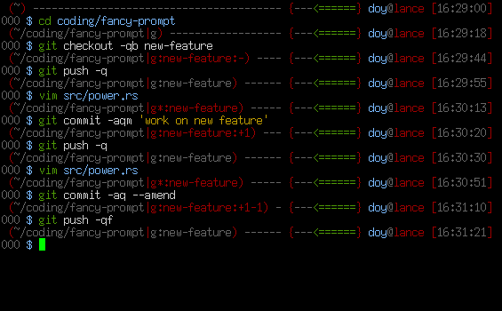

# fancy-prompt [](https://travis-ci.org/doy/fancy-prompt)

`fancy-prompt` is an improved shell prompt with several useful features.

## Screenshots



## Features

* Git integration
* Battery meter
* Customizable colors

## Installation

`fancy-prompt` is a command which generates prompt output directly. First,
install the `fancy-prompt` binary itself:

```
cargo install fancy-prompt
```

Then, configure fancy-prompt for your shell:

### `zsh`

```
function shell_prompt_precmd () {
    PROMPT=`fancy-prompt --prompt-escape zsh $?`
}
precmd_functions+=(shell_prompt_precmd)
```

### `bash`

```
export PROMPT_COMMAND="__err=\$?;$PROMPT_COMMAND;PS1=\"\$(fancy-prompt --prompt-escape bash "\$__err")\""
```

### `fish`

```
function fish_prompt
    fancy-prompt $status
end
```

## Configuration

You can customize the colors that `fancy-prompt` uses via the
`FANCY_PROMPT_COLORS` environment variable. It should contain a `,`-separated
list of key-value pairs separated by `=`. For instance:

```
export FANCY_PROMPT_COLORS=user_doy=bright_blue,host_lance=red
```

### Color names

* `black`
* `blue`
* `cyan`
* `green`
* `magenta`
* `red`
* `white`
* `yellow`
* `bright_black`
* `bright_blue`
* `bright_cyan`
* `bright_green`
* `bright_magenta`
* `bright_red`
* `bright_white`
* `bright_yellow`

### Display element names

* `user_%s`: Color of the username and the prompt character for that username.
* `host_%s`: Color of the hostname and various highlight elements of the prompt
  (to help visually differentiate between being logged into different hosts).
* `path_not_writable`: Color of the path when you are in a directory without
  write permissions.
* `path_not_exist`: Color of the path when you are in a directory that no
  longer exists.
* `vcs_dirty`: Color of the VCS output when the local repository has changes
  that are not in the upstream repository.
* `vcs_error`: Color of the VCS output when there was an error determining
  repository state.
* `battery_full`: Color of the battery meter when the battery is above 80%.
* `battery_warn`: Color of the battery meter when the battery is between 15%
  and 40%.
* `battery_crit`: Color of the battery meter when the battery is between 5% and
  15%.
* `battery_emerg`: Color of the battery meter when the battery is below 5%.
* `battery_charging`: Color of the battery meter when the battery is charging.
* `default`: Default color of unimportant parts of the prompt.
* `error`: Color to use for errors in parts of the prompt that don't have their
  own error color.

## Contributing

I am very interested in patches to make the prompt more useful or configurable.
Currently it has a very limited amount of configurability because it works for
me and I don't want to spend time on extra configurability that nobody will
use, but if there is something you want, let me know (or send patches) and I'll
see what i can do.

One thing to keep in mind is that in order to be useful, the prompt needs to
run as quickly as possible. Try to avoid features that add unnecessary latency
to the prompt display.
